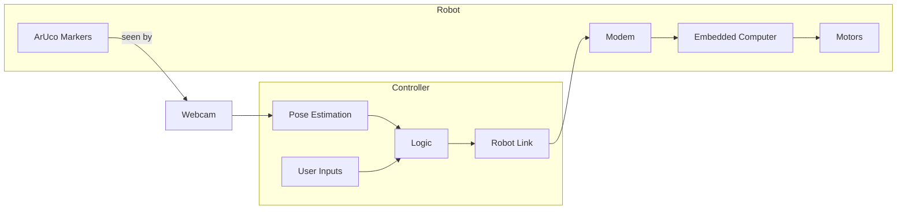

# The Man with the Plan
I have always been mainly a software developer. I used to say that my job starts when electrons become bits. However, I have always had a fascination with the real world, being human and all. I want to bring software into the real world. But working with physical things has never been my strength. I always wish I could "git revert" my mistakes. Therefore, I am starting this project with the goal of creating a simple robot. The primary objective is to learn, not necessarily to build a robot that does anything particularly useful.

My current plan is to create a simple 2-wheel robot that I can remote control using the keyboard, where the robot will stay within some virtual boundaries.

## The Goals
There are two concepts that I want to learn and experiment with:

### Simulator-Driven Hardware Development
I am a software guy and like software things. The best property of software is that it does the same thing every time. With a bit of work, you can generate tests that will always succeed or fail. And that gives you the ability to go fast and break things. If things go wrong, revert, and all is forgiven. Hardware gives no such privileges. If you mess up once, that's it. You have to fix it from whatever mess you have now. But there is a way to bring the power of software to the hardware world, at least partially: the simulator.

So the plan is to develop the robot in a simulator first and have all business logic and all the code that it deals with run there. Most of the robot's code should not and does not need to know if it's running as part of the simulation or on real hardware. I plan to only simulate what the code cares about—no CPU emulation or stuff like that. The simulator is great for handling the known knowns.

The next step is to play around with hardware-in-the-loop testing, where the robot code runs on an embedded computer, but the motors and other things it talks to are faked. As in, the robot thinks it's driving around but is really just laying there on the table, updating the simulation as it goes. Hardware-in-the-loop is great for the known unknowns.

And in the final step, build the robot. Hopefully, it won't give me too many problems after everything is tested, but you never know. For the unknown unknowns, you just need to try.

### Dumb Edge, Smart Core
The software on a server or my computer is very easy to update. The software on the robot is harder to upgrade. So I want the brains of the robot to be running on my computer, not on the robot itself. 

To keep the robot as simple and "dumb" as possible, I plan to track its position externally. As in, the robot is blind and deaf, has no perception at all, but is always connected to central control.

The robot will need wireless connectivity and will need to deal with all the hassle of networking. The network is only reliable when you don't need it to be. If you need reliable networking, that is when it fails 100% of the time, guaranteed. So that will increase complexity a bit.

But for me, a mainly software guy, I think the tradeoff is worth it. My development computer is a much easier place for me to innovate than on an embedded board.

## My Initial Plan
This is just the plan I have right now. This is not how it will look when I am done. If that is the case, then I have failed to learn. I already knew everything, and this was just a very expensive way to clarify that.

### The Real World
Motors will move the robot. And on top of the robot, it will have ArUco markers. These markers will be seen by a simple webcam from above that is connected to the main computer where the control software is running.

### Controller
The controller will most likely be written in Rust using the actor pattern architecture. It will have four main actors:

* Pose Estimator: Finds all the markers in the image and turns that into an estimated absolute position.
* User Input: Collects key presses.
* Logic: Takes the position and user commands and determines what commands to send to the robot.
* Robot Link: Encodes the commands in a way the robot understands and sends them over the network.

### The Robot
The robot will be a simple 2-motor, 2-wheel design that drives like a tank.

It will just blindly take the commands it receives from the modem and transfer them to the motors. There will be a little bit of logic to ensure that if it loses connection with the controller, it will just stop.

I also hope to have the robot code written in Rust.

### The Simulator
I plan to use the Godot game engine as my main simulation environment and use Godot Rust for the communication between the robot/controller and the simulation.

## My Next Step
My next step is to just get something that kind of looks like a robot running in Godot using only Godot. I am not a game developer and do not have much experience with 3D, so I need to learn the basics.

*As I'm dyslexic, AI has been used to help with spelling and grammar.*